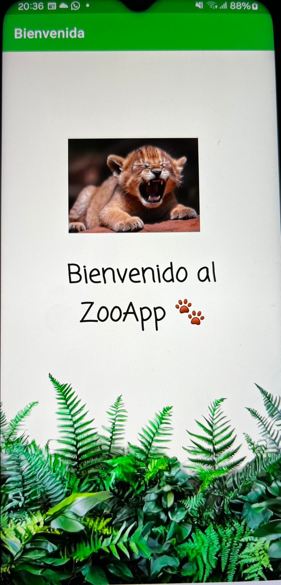
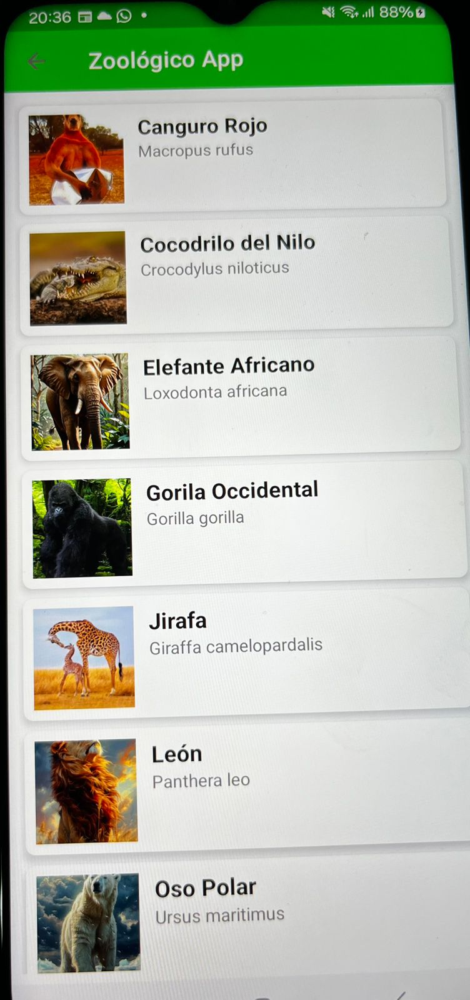
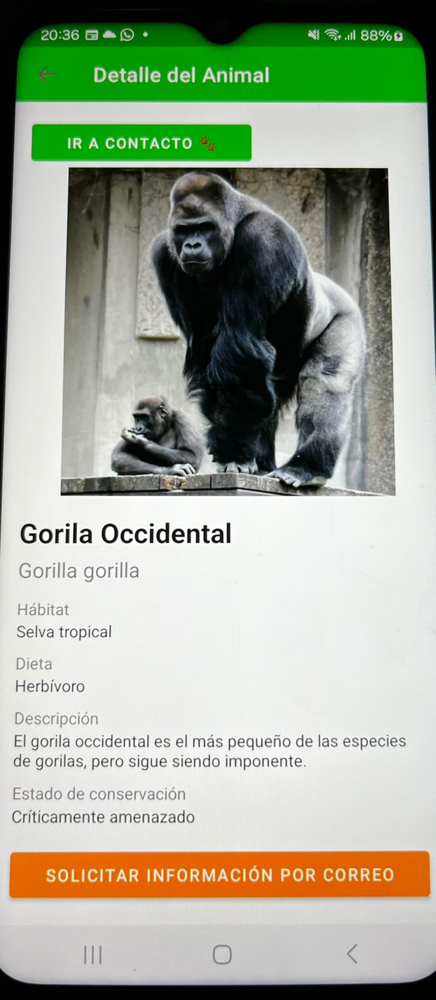
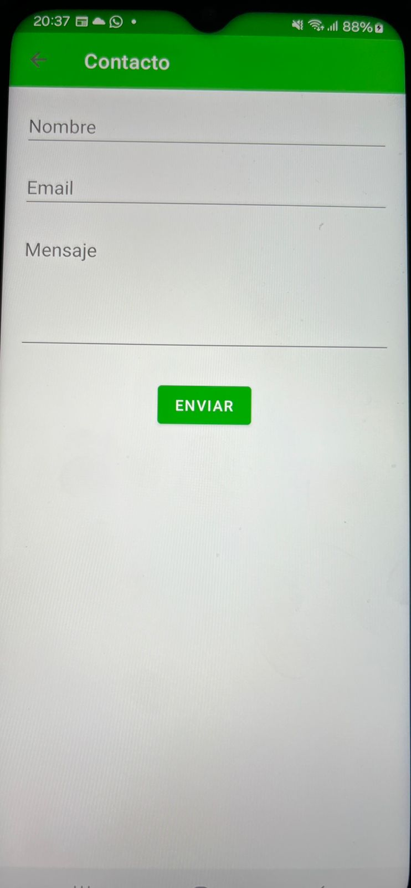

# 🐾 ZooApp

Aplicación Android desarrollada en Kotlin que permite visualizar una lista de animales, ver sus detalles y contactar mediante un formulario.

---

## 📱 Características

* 🌿 Pantalla de bienvenida (Splash)
* 📋 Lista de animales
* 🔍 Vista de detalle
* 📩 Formulario de contacto
* 🦁 Diseño personalizado con temática de selva

---

## 🛠 Tecnologías utilizadas

* Kotlin
* Android Studio
* Fragments
* Navigation Component
* ViewBinding

---

## 🚀 Cómo ejecutar el proyecto

1. Clonar el repositorio:

```
git clone https://github.com/NiniDev92/evaluacion-M6.git
```

2. Abrir en Android Studio

3. Ejecutar en emulador o dispositivo físico

---

## 📦 APK

El proyecto incluye un APK listo para instalación.

---

## 📸 Capturas de pantalla

### 🌿 Splash


### 📋 Lista


### 🔍 Detalle


### 📩 Contacto



## 💜 Sobre mí

Hola! 👋 Soy Nini
Desarrolladora de apps Android trainee, amante de los gatitos 🐱 y la tecnología.

---

✨ Proyecto desarrollado como parte de evaluación final.
